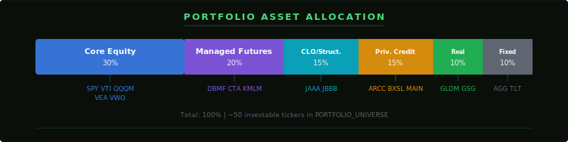
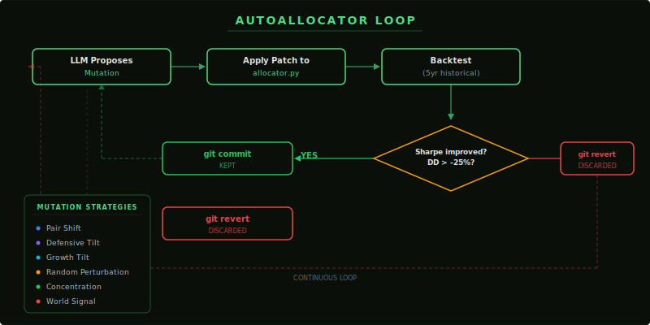
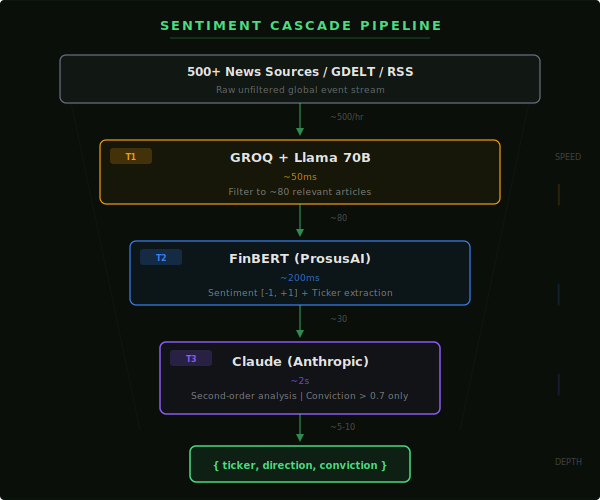
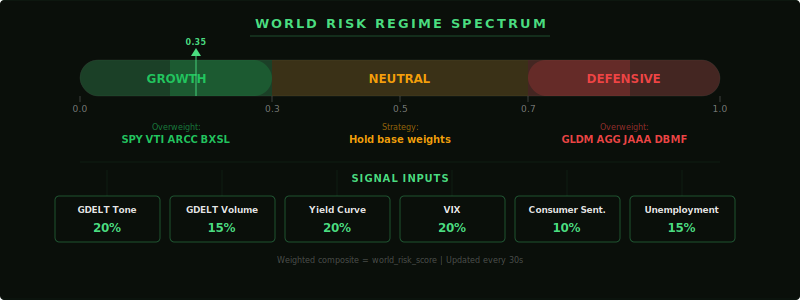

<p align="center">
  <strong>Parallax Intelligence</strong><br>
  <em>AI-powered global signal detection & autonomous portfolio construction</em>
</p>

<p align="center">
  
  
  
  
  
  
</p>

---

A real-time financial intelligence platform that ingests global event signals, runs them through a multi-stage AI sentiment cascade, and autonomously constructs and optimizes investment portfolios. The system has full agency: it researches, decides, and executes.

## Problem

Retail investors are locked into symmetric, passive portfolios (60/40, target-date funds) while institutional investors access private credit, managed futures, and alternative strategies with better risk-adjusted returns. World events move markets in ways passive portfolios can't respond to.

> A 60/40 portfolio has a Sharpe ratio of ~0.55. Adding 30% alternatives improves it to ~0.75 while *reducing* volatility from 10.9% to 8.9%.
> -- CFA Institute

## Solution

| Layer | What it does |
|-------|-------------|
| **Signal Layer** | Real-time ingestion from GDELT, USGS, FRED, VIX, commodity futures. Every signal classified by sector. |
| **AI Sentiment Cascade** | Groq/Llama 70B (fast filter) &rarr; FinBERT (financial scoring) &rarr; Claude (deep second-order analysis) |
| **AutoAllocator** | Autonomous research loop: propose mutation &rarr; backtest 5yr &rarr; keep if Sharpe improves & drawdown holds &rarr; discard otherwise |
| **Portfolio** | 13 positions across 6 asset classes including managed futures, CLOs, and private credit BDCs |

---

## Investment Thesis

### The Asymmetric Portfolio

Traditional portfolios are **symmetric** — they go up and down equally with the market. A 60/40 allocation (60% S&P 500, 40% bonds) has been the default for decades, but it suffers from a critical flaw: **when correlations spike in a crisis, stocks and bonds fall together** (2022 was the worst 60/40 year in decades — both sides lost money simultaneously).

Our thesis: construct **asymmetric portfolios** that capture upside in growth regimes but rotate into convex instruments during regime shifts. This requires two capabilities traditional tools don't have:

1. **Real-time world awareness** — detecting regime shifts as they happen, not after quarterly earnings calls
2. **Autonomous allocation** — rebalancing faster than a human advisor, with a paper trail for every decision

### Why These Asset Classes

| Asset Class | Role in Portfolio | Why Retail Couldn't Access It (Until Recently) |
|---|---|---|
| **Managed Futures** (DBMF, KMLM, RPAR) | Crisis alpha — trend-following strategies that profit from sustained moves in either direction. In 2022, managed futures posted +20-40% while 60/40 lost -17%. | Previously required $1M+ minimums at CTA hedge funds. ETF wrappers (launched 2022-2024) brought minimums down to one share (~$25). |
| **CLO / Structured Credit** (JAAA, CLOA) | Yield generation with AAA credit quality. 5.5-5.6% yield at 0.20% fees with near-zero default history at the AAA tranche. | Institutional-only until Janus Henderson launched JAAA (2020). Now $25B AUM — the fastest-growing fixed income ETF ever. |
| **Private Credit BDCs** (ARCC, BXSL) | Direct lending to middle-market companies. 9-13% dividend yields backed by Ares ($400B AUM) and Blackstone platforms. | Interval funds required $10K-$10M minimums. Publicly traded BDCs (ARCC, BXSL, OBDC) trade on NYSE with no minimum. |
| **Real Assets** (GLDM, PDBC) | Inflation hedge and portfolio insurance. Gold has a -0.02 correlation with equities over 50 years — true diversification. | Always accessible, but proper sizing (5-15%) is the hard part. Our system dynamically weights based on macro signals. |

### The Evidence

- A portfolio of 40% PE, 30% private credit, 20% RE, 10% hedge funds achieved a **Calmar ratio of 1.83** over 20 years vs. the S&P 500's **0.18** (Future Standard)
- Private credit market grew from $250B (2007) to **$2.5T** (2025) — J.P. Morgan calls it "essential, not optional"
- SEC's August 2025 policy change eliminated minimum investment requirements for registered alternative funds
- Managed futures have **positive crisis alpha**: +20-40% in 2022, +30% in 2008, +15% in 2020 COVID crash (Kathryn Kaminski, AlphaSimplex)

### Portfolio Allocation

<p align="center">
  
</p>

### Our Benchmark

| Metric | Our Target | 60/40 Baseline | Why It Matters |
|---|---|---|---|
| **Sharpe Ratio** | > 1.5 | ~0.55 | Return per unit of total risk |
| **Sortino Ratio** | > 2.0 | ~0.70 | Return per unit of *downside* risk (penalizes losses, not volatility) |
| **Max Drawdown** | < -15% | -34% (2022) | Worst peak-to-trough loss — the number that makes people panic-sell |
| **Calmar Ratio** | > 1.0 | ~0.18 | CAGR divided by max drawdown — the ultimate risk-adjusted metric |
| **Tail Ratio** | > 1.0 | ~0.85 | Right tail / left tail — measures positive skew (asymmetry) |

---

## AutoAllocator: Autonomous Portfolio Optimization

### Inspiration

Adapted from [karpathy/autoresearch](https://github.com/karpathy/autoresearch), which uses an AI agent to autonomously run ML experiments — proposing changes, evaluating results, keeping improvements, discarding regressions. We apply the identical pattern to portfolio allocation.

<p align="center">
  
</p>

### How Autoresearch Maps to Finance

| Autoresearch Concept | Our Implementation | File |
|---|---|---|
| `train.py` (agent-modifiable code) | `allocator.py` — portfolio weights, risk thresholds, rebalance logic, sentiment sensitivity | `ai-engine/autoallocator/allocator.py` |
| `prepare.py` (immutable data) | Market data pipeline — yfinance prices, FRED macro, GDELT signals | `ai-engine/data/` |
| `program.md` (agent instructions) | Investment policy — position limits, drawdown caps, turnover constraints | `ai-engine/autoallocator/policy.md` |
| `val_bpb` (fitness metric) | Rolling Sharpe ratio + max drawdown constraint | Computed by QuantStats |
| 5-minute training run | 5-minute backtest over 5 years of historical data | `ai-engine/autoallocator/backtest_runner.py` |
| Keep/discard gate | If Sharpe improves AND max drawdown > -25% &rarr; `git commit`. Otherwise &rarr; `git revert`. | `ai-engine/autoallocator/loop.py` |
| Experiment log | TSV log with timestamp, status, Sharpe, Sortino, max DD, CAGR, description | `ai-engine/autoallocator/experiment_log.tsv` |

### The Loop

```python
class AutoAllocatorLoop:
    """
    1. LLM proposes a change to allocator.py
    2. Change is applied
    3. Backtest runs (~5 min) against 5 years of historical data
    4. If Sharpe improves AND max drawdown > -25% -> KEEP (git commit)
    5. Otherwise -> REVERT (git checkout)
    6. Log result to experiment_log.tsv
    7. Repeat forever
    """

    def evaluate_and_decide(self, description: str) -> bool:
        result = self.runner.run()

        improved = (
            result.sharpe_ratio > self.best_sharpe
            and result.max_drawdown > MAX_DRAWDOWN_LIMIT  # -25%
        )

        if improved:
            self.best_sharpe = result.sharpe_ratio
            self._git_commit(f"autoallocator: {description}")
            self._log_experiment("KEPT", result, description)
        else:
            self._git_revert()
            self._log_experiment("DISCARDED", result, description)

        return improved
```

### Six Mutation Strategies

The AI agent proposes mutations from six strategy families:

| Strategy | What It Does | When It Fires |
|---|---|---|
| **Pair Shift** | Rebalances weight between two correlated positions (e.g., SPY ↔ VTI) | Routine optimization |
| **Defensive Tilt** | Rotates into GLDM, AGG, JAAA, DBMF | World risk score > 0.7 |
| **Growth Tilt** | Rotates into SPY, VTI, ARCC, BXSL | World risk score < 0.3 |
| **Random Perturbation** | Small random noise to explore the weight space | Every N iterations (explore vs exploit) |
| **Concentration** | Increases conviction on top-performing positions | Backtest shows clear winners |
| **World Signal** | Direct response to real-time events (e.g., Hormuz disruption → overweight DBMF, GLDM) | Sentiment cascade produces high-conviction signal |

### Hard Policy Constraints

These are inviolable — the agent cannot override them:

```
Position Limits:     No position > 25% or < 1%
                     Min 8 distinct positions

Asset Class Bands:   Core equity:        15-40%
                     Managed futures:    10-30%
                     CLO / structured:    5-20%
                     Private credit:      5-20%
                     Real assets:         5-15%
                     Fixed income:        5-20%

Risk Limits:         Max drawdown:       -25% (hard stop)
                     Max monthly loss:   -12%
                     Annual turnover:     300% cap

Benchmark:           Must beat 60/40 (SPY 60% / AGG 40%) on Sharpe
```

### What allocator.py Looks Like

This is the file the AI agent evolves. Current state:

```python
BASE_WEIGHTS = {
    "SPY":  0.20,  "VTI":  0.10,   # Core equity (30%)
    "DBMF": 0.10,  "KMLM": 0.05,  "RPAR": 0.05,  # Managed futures (20%)
    "JAAA": 0.10,  "CLOA": 0.05,   # CLO / structured credit (15%)
    "ARCC": 0.08,  "BXSL": 0.07,   # Private credit BDCs (15%)
    "GLDM": 0.05,  "PDBC": 0.05,   # Real assets (10%)
    "AGG":  0.05,  "SRLN": 0.05,   # Fixed income (10%)
}

RISK_THRESHOLD_HIGH = 0.7   # Shift to defensive above this
RISK_THRESHOLD_LOW  = 0.3   # Shift to growth below this
REGIME_SHIFT_MAGNITUDE = 0.03
SENTIMENT_WEIGHT = 0.15
MIN_CONVICTION = 0.3
REBALANCE_FREQUENCY = "monthly"
```

Every parameter in this file is a mutation target. The agent can shift weights, adjust thresholds, change rebalance frequency, or modify sentiment sensitivity — then the change is immediately backtested.

---

## Sentiment Pipeline

<p align="center">
  
</p>

Three-tier cascade optimized for speed and accuracy:

```
                    [News / GDELT / RSS Feeds]
                              |
                    +---------+---------+
                    |   TIER 1: GROQ    |   ~50ms per article
                    |   Llama 70B       |   "Is this financially material?"
                    |   14,400 req/day  |   Filter: 500 articles -> ~80 relevant
                    +---------+---------+
                              |
                    +---------+---------+
                    |  TIER 2: FINBERT  |   ~200ms per article
                    |  ProsusAI/finbert |   P(positive), P(neutral), P(negative)
                    |  Domain-specific  |   Sentiment = P(pos) - P(neg) in [-1, +1]
                    |  financial NLP    |   + ticker extraction + sector classification
                    +---------+---------+
                              |
                    +---------+---------+
                    | TIER 3: CLAUDE    |   ~2s per signal
                    | claude-sonnet     |   Only for conviction > 0.7
                    | Deep reasoning    |   "What are the second-order effects?"
                    |                   |   e.g., Houthi attack -> shipping rates ->
                    |                   |   insurance premiums -> energy ETFs
                    +---------+---------+
                              |
                              v
              { ticker, sector, direction, conviction, reasoning }
                              |
                              v
                    Time-weighted aggregation (6-hour half-life)
                    Conviction = 70% signal strength + 30% corroboration
```

## Composite World Risk Score

<p align="center">
  
</p>

Six signals combined into a single 0-1 risk score that directly drives portfolio allocation:

```python
WEIGHTS = {
    "gdelt_tone":           0.20,  # Falling tone = rising risk
    "gdelt_volume":         0.15,  # Rising volume = rising attention
    "yield_inversion":      0.20,  # T10Y2Y < 0 = recession signal
    "vix":                  0.20,  # >30 crisis, <15 calm
    "consumer_sentiment":   0.10,  # Lower = worse
    "unemployment_trend":   0.15,  # Higher = worse
}
```

| Risk Score | Regime | Portfolio Response |
|---|---|---|
| 0.0 - 0.3 | Growth | Overweight SPY, VTI, ARCC, BXSL |
| 0.3 - 0.7 | Neutral | Hold base weights |
| 0.7 - 1.0 | Defensive | Overweight GLDM, AGG, JAAA, DBMF |

---

## Architecture

```
Signal Layer (TypeScript/Vite)        AI Engine (Python/FastAPI)
+--------------------------+          +--------------------------+
| 3D Globe + Map Viz       |          | Sentiment Pipeline       |
| News Aggregation         |   REST   |   Groq -> FinBERT ->     |
| Risk Dashboards          | <------> |   Claude                 |
| Portfolio UI             |          | AutoAllocator Loop       |
| AI Insights Panels       |          | Composite Risk Scoring   |
+--------------------------+          +--------------------------+
        |                                      |
        v                                      v
  GDELT  USGS  FRED  VIX              yfinance  bt  QuantStats
```

### API Endpoints (AI Engine)

| Endpoint | Returns |
|---|---|
| `GET /api/portfolio` | Live portfolio positions with 7-day P&L |
| `GET /api/backtest` | Current Sharpe, Sortino, Calmar vs 60/40 benchmark |
| `GET /api/experiments` | Last 50 AutoAllocator experiments (KEPT/DISCARDED) |
| `GET /api/signals` | Live world event signals feeding the optimizer |
| `GET /api/risk` | Composite risk score (total, geopolitical, macro, volatility) |

---

## Quick Start

### 1. Clone and install

```bash
git clone https://github.com/ViktorSmirnov71/null-fellows-hack.git
cd null-fellows-hack
```

### 2. Configure API keys

```bash
cp .env.example .env.local
cp frontend/.env.example frontend/.env.local
```

Add your API keys to both `.env.local` files. All keys are optional — the dashboard runs without them, but adding them unlocks more features:

| Key | Free Tier | Get it at | What it unlocks |
|---|---|---|---|
| `GROQ_API_KEY` | 14,400 req/day | [console.groq.com](https://console.groq.com) | AI market insights, headline summarization, sentiment filtering |
| `FRED_API_KEY` | Unlimited | [fred.stlouisfed.org](https://fred.stlouisfed.org/docs/api/api_key.html) | GDP, CPI, yield curves, VIX, unemployment — macro signals |
| `FINNHUB_API_KEY` | 60 req/min | [finnhub.io](https://finnhub.io) | Live stock quotes, earnings, IPO data |

### 3. Start the Signal Layer

```bash
cd frontend
npm install
npm run dev:finance
```

Opens at **http://localhost:3000**

### 4. Start the AI Engine

```bash
cd ai-engine
python -m venv venv && source venv/bin/activate
pip install -r requirements.txt
python server.py
```

Runs at **http://localhost:8001** — the signal layer connects to it automatically for portfolio data, risk scores, and sentiment signals.

---

## Project Structure

```
parallax-intelligence/
+-- frontend/                   # Signal layer & visualization
|   +-- src/components/         # Portfolio, AutoAllocator, Risk, Insights panels
|   +-- src/services/           # Data fetching, AI summarization
|   +-- api/                    # Edge functions (Groq/OpenRouter proxy)
|   +-- server/                 # Server-side RPC handlers
+-- ai-engine/                  # Python AI backend
|   +-- sentiment/
|   |   +-- pipeline.py         # 3-tier cascade orchestration
|   |   +-- groq_filter.py      # Tier 1: fast relevance filtering
|   |   +-- finbert_scorer.py   # Tier 2: financial sentiment scoring
|   |   +-- claude_analyst.py   # Tier 3: deep second-order analysis
|   |   +-- signal_aggregator.py # Time-weighted signal aggregation
|   +-- autoallocator/
|   |   +-- allocator.py        # THE agent-modified file (portfolio weights)
|   |   +-- loop.py             # Autonomous propose-backtest-decide loop
|   |   +-- backtest_runner.py  # bt + QuantStats backtesting harness
|   |   +-- policy.md           # Inviolable investment constraints
|   +-- data/
|   |   +-- yfinance_client.py  # Market data + PORTFOLIO_UNIVERSE
|   |   +-- fred_client.py      # FRED macro indicators
|   |   +-- gdelt_client.py     # Geopolitical tone + volume signals
|   |   +-- risk_scorer.py      # 6-signal composite risk scoring
|   +-- server.py               # FastAPI with background optimizer thread
+-- backend/                    # FastAPI portfolio service
+-- supabase/                   # Database schema
```

## References

- [karpathy/autoresearch](https://github.com/karpathy/autoresearch) -- Autonomous AI experiment loop (core pattern)
- [ProsusAI/finBERT](https://github.com/ProsusAI/finBERT) -- Financial domain sentiment model
- [QuantStats](https://github.com/ranaroussi/quantstats) -- Portfolio risk metrics & tearsheets
- [bt (backtesting)](https://pmorissette.github.io/bt/) -- Portfolio-native backtesting framework
- CFA Institute -- *The 60/40 Portfolio Needs an Alts Infusion*
- J.P. Morgan -- *Alternative Investments Outlook 2026*
- Kathryn Kaminski (AlphaSimplex) -- Crisis Alpha of Managed Futures

## License

[MIT](LICENSE)

---

<p align="center">Built by <strong>Null Fellows</strong></p>
